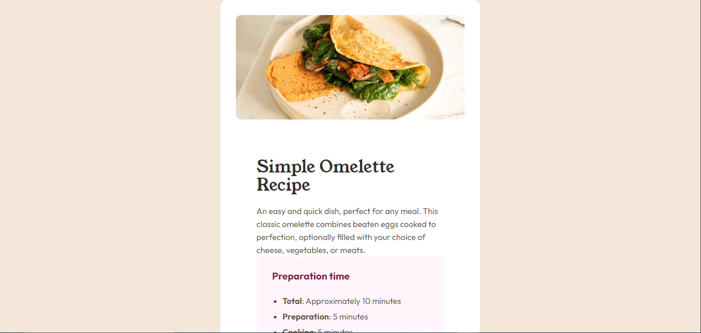

# Frontend Mentor - Recipe page solution

This is a solution to the [Recipe page challenge on Frontend Mentor](https://www.frontendmentor.io/challenges/recipe-page-KiTsR8QQKm). Frontend Mentor challenges help you improve your coding skills by building realistic projects. 

## Table of contents

- [Overview](#overview)
  - [Screenshot](#screenshot)
  - [Links](#links)
- [My process](#my-process)
  - [Built with](#built-with)
  - [What I learned](#what-i-learned)
  - [Continued development](#continued-development)
  - [Useful resources](#useful-resources)
- [Author](#author)
- [Acknowledgments](#acknowledgments)


## Overview

### Screenshot





### Links

- Solution URL: [FEM Recipe Page](https://github.com/davichriss/fem-recipe-page)
- Live Site URL: [FEM Recipe Page Live Review](davichriss.github.io/fem-recipe-page/)

## My process

### Built with

- Semantic HTML5 markup
- CSS custom properties
- CSS for styling
- Mobile-first workflow

### What I learned

I learned how to make use of the CSS custom properties which makes it possible for me to easily reuse certain properties of my design. in the code snippet below, i created custom properties for different clors of the design, and also created some custom properties for font-sizes in my design.


```css
:root {
--fs-1:32px;
--fs-2:28px;
--fs-3:19px;
--fs-base: 16px;
--White: hsl(0, 0%, 100%);
--Stone100: hsl(30, 54%, 90%);
--Stone150: hsl(30, 18%, 87%);
--Stone600: hsl(30, 10%, 34%);
--Stone900: hsl(24, 5%, 18%);
--Brown800: hsl(14, 45%, 36%);
--Rose800: hsl(332, 51%, 32%);
--Rose50: hsl(330, 100%, 98%);

}

```
I also learned how to make use of semantic html tags in my html structure, as seen below with the main and the section tags
```html
<main>
    <section></section>
</main>
```

### Continued development
I need to understand more about the use of media queries in CSS.
I also aalso need to understand more on import fons locally after downloading using css.
### Useful resources
-[w3schools](https://www.w3schools.com)- This website assisted in implementing font import using the @font-face css asset


## Author

- Website - [davichriss](https://github.com/davichriss/fem-recipe-page)
- Frontend Mentor - [@davichriss](https://www.frontendmentor.io/profile/davichriss)


## Acknowledgments
I thank [Eschosys](https://www.eschosys.com) for showing me how to use Frontendmentor.
